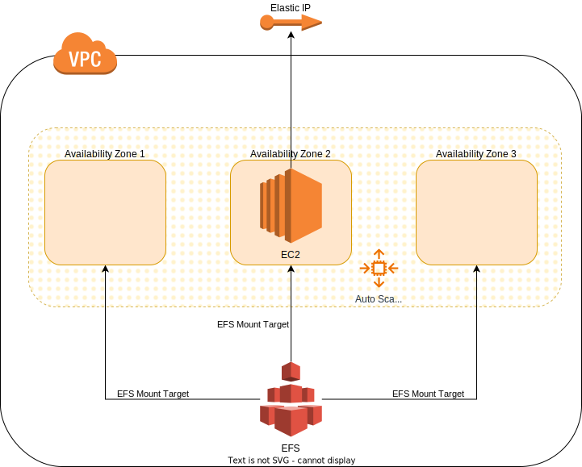

# Deploy EC2 instance with durable directory

## Overview

This code shows the deployment of an EC2 instance that, even
after experiencing an outage in its Availability Zone,
persists data in one directory in EFS (which protects against
outages of single AZs). The EC2 instance itself is part of
an autoscaling group that ensures that it is restarted after
an outage.

Note: EFS is mounted at `/efs` and it might take several minutes
after the EC2 instance startup until the EFS mount target can be
resolved by its DNS name and mounted thereafter.



## Test Failover

1. Deploy infrastructure

   ```bash
   terraform init
   terraform apply
   ```

2. Connect to EC2 instance and put some data under `/efs`.
3. Get ID of EC2 instance

   ```bash
   aws autoscaling describe-auto-scaling-instances
   ```

4. Terminate instance

   ```bash
   aws autoscaling terminate-instance-in-auto-scaling-group --instance-id <instance id> --no-should-decrement-desired-capacity
   ```

5. Wait for replacement of EC2 instance.
6. Connect to new EC2 instance (will use the same IP address) and check `/efs`.
